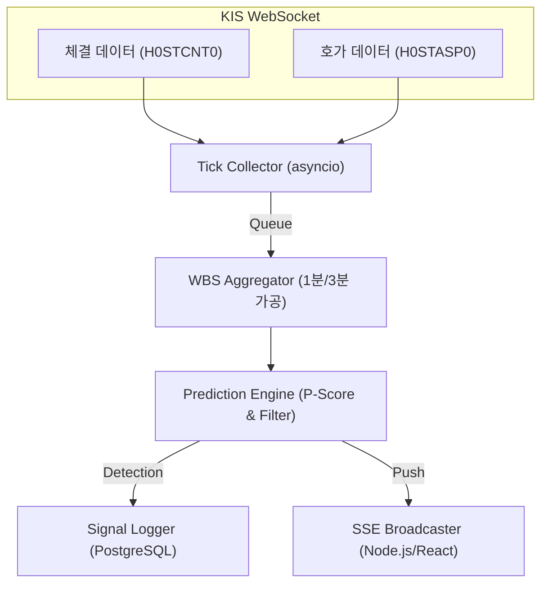

# MP-TASK-RT-ENGINE-001
## 실시간 수급 예측 엔진 (Real-time Prediction Engine) 개발 작업지시서

- **발행일**: 2026-04-09
- **버전**: v1.0
- **프로젝트**: MP Stock Discovery — Real-time Prediction Engine
- **담당자**: 개발 에이전트
- **검토자**: 데니얼 (MetaPrompt Studio)
- **우선순위**: 🔴 Critical

---

## 1. 작업 배경 및 목적

### 1.1 배경
MP Stock Discovery의 백테스트 엔진(WBS Analyzer)은 합성 데이터 기반 시뮬레이션 검증이 완료된 상태이다. 
이 작업지시서는 해당 검증 로직을 실제 KIS API 실시간 데이터 스트림에 이식하여, 회원이 장중에 실제로 사용할 수 있는 예측 매매 시나리오 엔진으로 전환하기 위한 전체 개발 지시를 담는다.

### 1.2 목적
- 회원에게 장중 실시간 수급 돌파 신호와 진입 기대 수익률 예측값을 제공한다.
- 백테스트에서 검증된 WBS(Weighted Buy Signal) 로직을 실시간 이벤트 기반 구조로 전환한다.
- 지연 0.5초 이내 신호 판정, 프론트엔드 즉시 Push의 성능 목표를 달성한다.

### 1.3 설계안 원본 검토 결과 (Red Team 지지사항 반영)
원본 설계안의 오류 및 누락 사항을 보완하여 아래 항목을 모두 반영하여 개발한다.

| 번호 | 분류 | 원본 문제점 | 보완 방향 |
|:---:|:---:|:---|:---|
| **R-01** | 신뢰성 | KIS WebSocket 인증 토큰 만료(30분) 처리 미정의 | 자동 토큰 갱신(Re-auth) 루프 필수 구현 |
| **R-02** | 신뢰성 | 네트워크 단절 시 재접속 로직 미포함 | Exponential Backoff 재접속 전략 명시 |
| **R-03** | 예측 정확도 | +1.5%~3% 도달 확률 계산 근거 불명확 | 과거 WBS 분포 기반 조건부 확률 모델 정의 필요 |
| **R-04** | 누락 | 호가 잔량 데이터 소스 미정의 | KIS 실시간 호가(H0STASP0) 별도 구독 명시 |
| **R-05** | 누락 | 장 개시 전/후 처리 로직 없음 | 09:00 이전 Pre-market 모드, 15:30 이후 종료 로직 추가 |
| **R-06** | 성능 | CPU 최적화 방법 미구체화 | asyncio + uvloop 사용, 틱 누적 후 배치 분석 구조 명시 |
| **R-07** | 보안 | KIS API 키 처리 방식 미정의 | 환경변수(.env) 저장, 코드 내 하드코딩 절대 금지 |
| **R-08** | 신뢰성 | 예측 결과 로그 저장 구조 없음 | 시그널 발생 시 PostgreSQL/signals_log 테이블 저장 필수 |
| **R-09** | UI | 실시간 게이지 업데이트 주기 미정의 | SSE 이벤트 최소 1초 간격, 프론트 throttle 처리 명시 |
| **R-10** | 누락 | 오신호(False Signal) 필터링 로직 없음 | 최소 3틱 연속 조건 충족 시에만 신호 발생 규칙 추가 |

---

## 2. 시스템 아키텍처 (확정안)

---

## 3. 세부 개발 가이드라인

### 3.1 효율적 수급 분석 (Blue Team)
- **WBS 고도화**: 단순 체결량 합산이 아닌, 체결 강도와 호가 갭(Gap)을 반영한 가중치 수급 지수 적용.
- **실시간 예측**: 현재 수급 파워가 최근 1시간 평균 대비 300% 이상일 때 '수급 자석(Magnet)' 활성화 판정.

### 3.2 리스크 및 무결성 제어 (Red Team)
- **오신호 사살**: 단일 고액 체결은 무시. 최소 3회 이상의 연속 매수 수급이 발생해야 '유효 신호'로 인정.
- **Fail-safe**: KIS API 연결 장애 발생 시 UI에 '실시간 모니터링 중단' 및 '백테스트 모드 전환' 즉시 통보.

---
**데니얼 (MetaPrompt Studio) 승인 완료**
